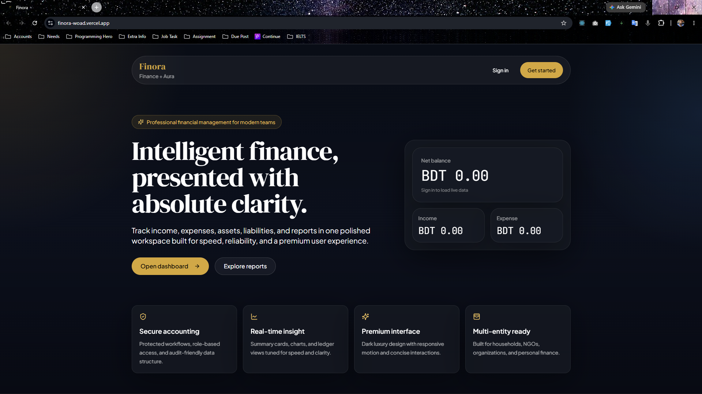

<div align="center">

# Finora — Personal Finance & Reporting



</div>

Finora is a premium personal finance workspace for individuals, freelancers, families, NGOs, and small businesses. It helps you track income, expenses, assets, liabilities, and categories, then turn that data into clean dashboards, reports, and downloadable PDFs.

Live demo: https://finora-woad.vercel.app

Repository: https://github.com/maksudulhaque2000/Finora

Author / Portfolio: https://maksudul-haque.vercel.app

---

## Overview

Finora is built with Next.js App Router and Prisma on top of MongoDB. The app is designed to feel fast, structured, and professional while keeping the data model simple enough for personal finance and flexible enough for multi-organization use.

The product focuses on four things:

- Clear financial visibility through charts and summary cards
- Fast, role-aware server routes for data access and reporting
- A polished dark interface with compact, single-screen landing and dashboard experiences
- Exportable reporting with Unicode-safe PDF generation for Bengali and English content

---

## Key Features

- Transaction tracking for income, expense, and transfer entries
- Category management with custom colors and icons
- Asset tracking for cash, bank, property, equipment, vehicles, inventory, and other holdings
- Liability tracking for loans, payables, dues, and other obligations
- Dashboard summaries with balances, charts, recent entries, and search-aware navigation
- Reports for income statement, balance sheet, cash flow, and monthly ledger
- PDF export with server-side generation and Bengali font embedding
- Multi-organization access control with role-based permissions
- Login with credentials plus optional Google and Facebook OAuth
- Responsive dark UI with loading skeletons, offline awareness, and quick navigation

---

## Main Product Areas

### Landing Page

The homepage is a single-viewport, premium-style landing page with a split hero layout, a database-driven snapshot panel, and a full-width row of feature cards below. It is intentionally compact so the key value proposition is visible without scrolling.

### Dashboard

The dashboard provides all-time income, expense, balance, and asset summaries, plus monthly charting and transaction lists. Search is wired into the top bar so users can jump between finance sections quickly.

### Transactions

Income and expense flows are handled through dedicated dashboard pages and a shared transaction form. The model supports optional recurring metadata and receipt/payment details.

### Assets and Liabilities

Assets and liabilities have dedicated management screens, summaries, and forms for creating and maintaining balance-sheet data.

### Reports

The reports area supports date range selection and PDF export for accounting-style reporting. The export route embeds a Unicode font so Bengali and English render correctly in the generated document.

### Settings

Users can manage account and organization settings, and the app includes deletion flows with cleanup on the server.

---

## UX And Performance Notes

- Global loading and navigation feedback are provided through shared providers and route-aware loading states
- The quick search in the top bar offers route suggestions and prefetching for snappier navigation
- Heavy client features are deferred where possible with dynamic imports
- Route transitions use skeletons and loading layouts for a smoother feel
- The app uses a compact dark visual language with subtle glass panels and premium typography
- Document titles update per route so browser tabs stay meaningful
- Offline awareness is surfaced with a banner when the network drops

---

## Tech Stack

- Next.js 14 with App Router
- React 18
- TypeScript
- Prisma ORM with MongoDB
- NextAuth v5
- Tailwind CSS
- Recharts for visualizations
- jsPDF and jspdf-autotable for PDF export
- Zustand for UI state
- next-themes for theme handling
- Framer Motion where small motion interactions are still needed

---

## Application Structure

### Client Side

- [app/page.tsx](app/page.tsx) — landing page
- [app/(dashboard)/dashboard/page.tsx](<app/(dashboard)/dashboard/page.tsx>) — dashboard overview and charts
- [app/(dashboard)/reports/page.tsx](<app/(dashboard)/reports/page.tsx>) — report controls and PDF export entry point
- [components/layout/topbar.tsx](components/layout/topbar.tsx) — search, route actions, and quick navigation
- [components/providers.tsx](components/providers.tsx) — session, theme, loading, toast, and quick navigation providers

### Server Side

- [app/api/transactions/](app/api/transactions/) — transaction CRUD and listing
- [app/api/categories/](app/api/categories/) — category CRUD
- [app/api/assets/](app/api/assets/) — asset CRUD
- [app/api/liabilities/](app/api/liabilities/) — liability CRUD
- [app/api/reports/](app/api/reports/) — summary, home overview, ledger, balance sheet, income statement, and PDF export
- [app/api/auth/](app/api/auth/) — NextAuth handlers and registration flow
- [lib/workspace.ts](lib/workspace.ts) — organization lookup and access checks
- [lib/auth.ts](lib/auth.ts) — NextAuth configuration
- [prisma/schema.prisma](prisma/schema.prisma) — database schema

---

## Data Model

The core schema lives in [prisma/schema.prisma](prisma/schema.prisma).

### Core Entities

- `User` — application user
- `Organization` — workspace container with type and default currency
- `OrganizationMember` — role-based membership between users and organizations
- `Category` — transaction categorization with icon and color metadata
- `Transaction` — financial entries with notes, receipt URL, payment method, and recurring fields
- `Asset` — asset records with type, value, and optional purchase date
- `Liability` — liability records with principal, balance, installment, interest, and due date

### Useful Enums

- `OrgType` — FAMILY, BUSINESS, NGO, PERSONAL
- `TransactionType` — INCOME, EXPENSE, TRANSFER
- `AssetType` — CASH, BANK, PROPERTY, EQUIPMENT, VEHICLE, INVENTORY, OTHER
- `LiabilityType` — LOAN, PAYABLE, DUE, OTHER
- `MemberRole` — OWNER, ADMIN, MEMBER, VIEWER

### Access Control

Workspace access is resolved through [lib/workspace.ts](lib/workspace.ts). The helper reads the current session, finds the user’s organization membership, and blocks access when the user is not part of the workspace.

---

## Authentication

Finora uses NextAuth v5 with PrismaAdapter support.

- Credentials login is enabled with email and password
- Google OAuth can be enabled by setting the matching client ID and secret
- Facebook OAuth can be enabled the same way
- Session cookies are configured for local and production environments
- The app stores organization membership on sign-in so downstream API routes can enforce workspace access

The relevant configuration lives in [lib/auth.ts](lib/auth.ts).

---

## API Overview

The API is organized by domain so the UI and server routes stay easy to reason about.

- Transactions: create, list, update, delete, and fetch by id
- Categories: create, update, delete, and list by organization
- Assets: create, update, delete, and list by organization
- Liabilities: create, update, delete, and list by organization
- Reports: summary, home overview, income statement, balance sheet, ledger, and PDF export
- Organizations: fetch or create workspace data
- Settings: update settings or delete the account and related data
- Auth: NextAuth handlers plus registration

The PDF export route is server-side only and renders Bengali correctly by embedding a local Unicode font.

---

## Local Development

### Prerequisites

- Node.js 20.x
- npm
- MongoDB connection string

### Install

```bash
git clone https://github.com/maksudulhaque2000/Finora.git
cd Finora
npm install
```

### Environment Variables

Create a local environment file such as `.env.local` with the following values:

```env
DATABASE_URL="mongodb+srv://<user>:<pass>@cluster0.mongodb.net/finora?retryWrites=true&w=majority"
AUTH_SECRET="your-auth-secret"
NEXTAUTH_SECRET="your-auth-secret"
AUTH_URL="http://localhost:3000"
NEXTAUTH_URL="http://localhost:3000"
NEXT_PUBLIC_APP_URL="http://localhost:3000"
GOOGLE_CLIENT_ID=""
GOOGLE_CLIENT_SECRET=""
FACEBOOK_CLIENT_ID=""
FACEBOOK_CLIENT_SECRET=""
ANALYZE="false"
```

Notes:

- `AUTH_SECRET` and `NEXTAUTH_SECRET` should use the same value
- `AUTH_URL`, `NEXTAUTH_URL`, and `NEXT_PUBLIC_APP_URL` can point to the same canonical URL
- OAuth credentials are optional unless you plan to use those providers
- `ANALYZE=true` enables bundle analysis during build

### Prisma

```bash
npm run prisma:generate
npm run prisma:seed
```

### Run

```bash
npm run dev
```

Then open `http://localhost:3000`.

---

## Production

```bash
npm run build
npm run start
```

For Vercel, the project also supports:

```bash
npm run vercel-build
```

This runs Prisma generation before the Next.js build.

---

## Scripts

- `npm run dev` — start the development server
- `npm run build` — create a production build
- `npm run start` — run the production server
- `npm run vercel-build` — Prisma generate plus production build
- `npm run lint` — run lint checks
- `npm run format` — format the codebase with Prettier
- `npm run prisma:generate` — generate the Prisma client
- `npm run prisma:seed` — seed the database
- `npm run clean:next` — remove the `.next` folder

---

## Deployment

Finora is ready for Vercel deployment.

- Set all required environment variables in the Vercel dashboard
- Make sure the canonical app URL matches the deployed domain
- If you enable OAuth, add the production callback URLs to the provider settings
- Use the included `vercel.json` and the standard Next.js build pipeline

---

## Project Structure

```text
app/         App Router pages, layouts, and API routes
components/  Reusable UI and page composition components
lib/         Auth, workspace, validation, formatting, and report helpers
prisma/      Schema and seed script
public/      Static assets, preview image, favicon, fonts
store/       UI state management
types/       Shared TypeScript types
```

---

## Visual Assets

The repository includes a preview image at [public/preview.png](public/preview.png). If you want, you can add more screenshots for the landing page, dashboard, and PDF export flow.

---

## Contributing

Contributions are welcome.

1. Fork the repository
2. Create a feature branch
3. Run build and lint locally
4. Open a pull request with a clear summary

If you want a `CONTRIBUTING.md`, `.env.example`, or issue templates, I can add them too.

---

## License

This project does not currently declare a license. If you plan to publish or distribute it, add one before doing so.

---

## Contact

- Live demo: https://finora-woad.vercel.app
- Repository: https://github.com/maksudulhaque2000/Finora
- Author / Portfolio: https://maksudul-haque.vercel.app
